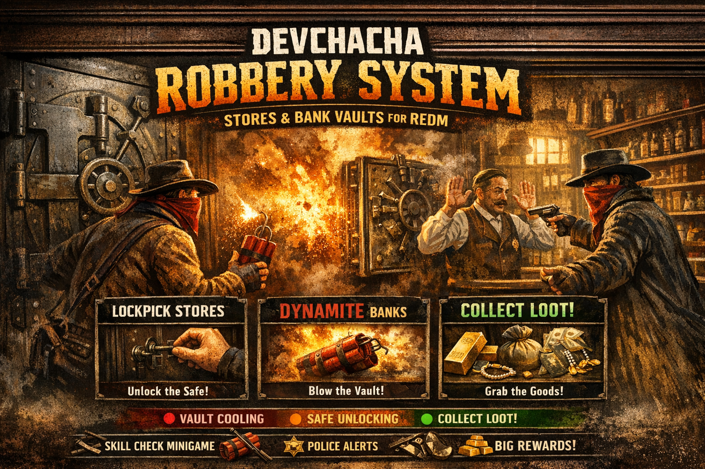

# 🏦 DevChaCha Robbery System

An advanced, optimized robbery system for **RSG-Core** (RedM) featuring stores and bank vaults with ox_lib integration.



---

## ✨ Features

### 🏪 Store Robberies
- **7 Pre-configured Stores**: Valentine, Rhodes, Saint Denis, Strawberry, Blackwater, Armadillo, Tumbleweed
- **Lockpick Required**: Uses `lockpick` item from inventory
- **Skill Check Minigame**: ox_lib skill check system
- **5-minute Unlock Timer**: Wait for the safe to unlock after disabling security

### 🏦 Bank Vault Robberies
- **5 Pre-configured Banks**: Valentine, Rhodes, Blackwater, Saint Denis, Armadillo
- **Dynamite Required**: Uses `tnt` item from inventory (consumed on use)
- **15-second Fuse Timer**: Plant dynamite and run before it explodes!
- **10-minute Cooling Timer**: Vault cools down after explosion before looting
- **Synchronized Explosions**: All nearby players see and hear the explosion

### 🎯 Optimized Timer Display
- **ox_lib TextUI**: Efficient UI that only updates when state changes
- **5-meter Detection Range**: Timer shows when within 5m of active robbery location
- **Color-coded Status**:
  - 🔴 **VAULT COOLING** (Dark Red) - Bank vault cooling down
  - 🟠 **SAFE UNLOCKING** (Orange) - Store safe unlocking
  - 🟢 **COLLECT LOOT!** (Green) - Ready to collect

### 🔒 One Robbery Per Session
- Once robbed, locations stay **looted until server/script restart**
- No time-based cooldowns - encourages strategic planning
- Clear "Already been robbed!" message when location is looted

### 👮 Police Integration & Alerts
- **Configurable Requirements**: Set minimum police required for store/bank robberies.
- **Alerts**: Automatically sent to all jobs listed in `Config.Police.Jobs`.
- **How to Add Jobs**: simply add your job name to the list in `config.lua`:
  ```lua
  Config.Police.Jobs = { 'sheriff', 'police', 'marshal', 'your_custom_job' }
  ```

---

## 📦 Dependencies

| Resource | Required |
|----------|----------|
| [rsg-core](https://github.com/Starter-Framework/rsg-core) | ✅ Yes |
| [ox_lib](https://github.com/overextended/ox_lib) | ✅ Yes |
| [ox_target](https://github.com/overextended/ox_target) | ✅ Yes |

---

## 📥 Installation

1. **Download** and extract to your resources folder
2. **Rename** folder to `devchacha-robbery`
3. **Add items** to `rsg-core/shared/items.lua`:
   - Open `devchacha-robbery/shared/items.lua` for reference
   - Copy the required items (`lockpick`, `tnt`) to your rsg-core items file
   - Add reward items if you don't have them:
     - `gold_ring`, `rolex` (store)
     - `gold_bar`, `diamond`, `bearer_bond`, `gold_certificate`, `confidential_ledger` (bank)
     - `railroad_bond`, `bank_draft`, `trust_deed`, `shipping_manifest` (bank)
     - `antique_jewelry_box`, `diamond_ring` (bank)
4. **Add images** to `rsg-inventory/html/images/`:
   - `lockpick.png`
   - `tnt.png`
   - (and any reward item images)
5. **Add** to `server.cfg`:
   ```cfg
   ensure ox_lib
   ensure ox_target
   ensure rsg-core
   ensure devchacha-robbery
   ```
6. **Open Bank Doors** - Update `rsg-banking/config.lua` (see below)
7. **Restart** your server

---

## 🚪 IMPORTANT: Open Bank Doors

For bank robberies to work, you need to **unlock all bank doors** in `rsg-banking/config.lua`.

Change all door `state` values from `1` (locked) to `0` (open):

```lua
Config.BankDoors = {

    -- valentine ( open = 0 / locked = 1)
    { door = 2642457609, state = 0 }, -- main door
    { door = 3886827663, state = 0 }, -- main door
    { door = 1340831050, state = 0 }, -- bared right
    { door = 2343746133, state = 0 }, -- bared left
    { door = 334467483,  state = 0 }, -- inner door1
    { door = 3718620420, state = 0 }, -- inner door2
    { door = 576950805,  state = 0 }, -- vault

    -- rhodes  ( open = 0 / locked = 1)
    { door = 3317756151, state = 0 }, -- main door
    { door = 3088209306, state = 0 }, -- main door
    { door = 2058564250, state = 0 }, -- inner door1
    { door = 3142122679, state = 0 }, -- inner door2
    { door = 1634148892, state = 0 }, -- inner door3
    { door = 3483244267, state = 0 }, -- vault

    -- saint denis ( open = 0 / locked = 1)
    { door = 2158285782, state = 0 }, -- main door
    { door = 1733501235, state = 0 }, -- main door
    { door = 2089945615, state = 0 }, -- main door
    { door = 2817024187, state = 0 }, -- main door
    { door = 1830999060, state = 0 }, -- inner private door
    { door = 965922748,  state = 0 }, -- manager door
    { door = 1634115439, state = 0 }, -- manager door
    { door = 1751238140, state = 0 }, -- vault

    -- blackwater ( open = 0 / locked = 1)
    { door = 531022111,  state = 0 }, -- main door
    { door = 2117902999, state = 0 }, -- inner door
    { door = 2817192481, state = 0 }, -- manager door
    { door = 1462330364, state = 0 }, -- vault door
    
    -- armadillo ( open = 0 / locked = 1)
    { door = 3101287960, state = 0 }, -- main door
    { door = 3550475905, state = 0 }, -- inner door
    { door = 1329318347, state = 0 }, -- inner door
    { door = 1366165179, state = 0 }, -- back door

}
```

> ⚠️ **If doors are locked (`state = 1`), players cannot access the vaults!**

---

## ⚙️ Configuration

### `config.lua`

```lua
-- Items Required
Config.Items = {
    Lockpick = 'lockpick',        -- For store robberies
    AdvancedLockpick = 'advancedlockpick',
    Dynamite = 'tnt',             -- For bank vaults (consumed)
}

-- Police Settings
Config.Police = {
    RequiredForStore = 0,         -- Min police for stores
    RequiredForBank = 0,          -- Min police for banks
    
    -- Jobs that will receive ALERTS
    Jobs = { 'sheriff', 'leo', 'police', 'marshal' } 
}

-- Timers (in minutes)
Config.RobberyDuration = 5        -- Store safe unlock time
Config.BankRobberyDuration = 10   -- Bank vault cooling time

-- Minigame Difficulty (ox_lib skill check)
Config.Difficulty = {
    StoreRegister = {'easy', 'easy', 'medium'},
    SafeCrack = {'medium', 'medium', 'hard'},
    DoorBreach = {'easy', 'medium'},
    BankDoor = {'medium', 'hard', 'hard'},
}

-- Rewards
Config.Rewards = {
    StoreSafe = {
        minCash = 100, maxCash = 300,
        items = {
            { name = 'gold_ring', amount = 1, chance = 80 },
            { name = 'rolex', amount = 1, chance = 40 }
        }
    },
    BankVault = {
        minCash = 500, maxCash = 2000,
        items = {
            { name = 'gold_bar', amount = {1, 3}, chance = 100 },
            { name = 'diamond', amount = {1, 2}, chance = 30 }
        }
    }
}
```

---

## 🎮 How to Use

### Store Robbery
1. **Get a Lockpick** from a store or crafting
2. **Go to any store** register (marked targets)
3. **Interact** with "Rob Store" option
4. **Complete** the skill check minigame
5. **Wait 5 minutes** for the safe to unlock
6. **Return** and collect your loot!

### Bank Robbery
1. **Get Dynamite (TNT)** - this is consumed when used
2. **Go to any bank** vault (marked targets)
3. **Interact** with "Blow Open Vault" option
4. **Plant dynamite** (4-second progress bar)
5. **RUN!** You have **15 seconds** before explosion
6. **Wait 10 minutes** for vault to cool down
7. **Return** and collect your loot!

---

## 🔄 Robbery States

| State | Description |
|-------|-------------|
| `nil` | Fresh - can start robbery |
| `unlocking` | Timer running - wait for completion |
| `open` | Ready to loot! |
| `looted` | Already robbed - resets on restart |

---

## 📁 File Structure

```
devchacha-robbery/
├── fxmanifest.lua      # Resource manifest
├── config.lua          # All configuration
├── README.md           # This file
├── client/
│   └── main.lua        # Client-side logic & UI
├── server/
│   └── main.lua        # Server-side validation & rewards
└── shared/
    └── items.lua       # Required items to copy to rsg-core
```

---

## ⚡ Performance

This script is **highly optimized**:
- ✅ **Single thread** checking every 1 second (not every frame)
- ✅ **ox_lib TextUI** instead of per-frame 3D text rendering
- ✅ **State-change detection** - UI only updates when needed
- ✅ **Server-side validation** - prevents exploits and cheating
- ✅ **GlobalState sync** - all players see the same robbery status


---

## 🛡️ Anti-Exploit Features

- Server-side state validation before payouts
- Items checked and removed server-side
- Race condition prevention (looted before reward)
- Timer verification before looting allowed
- Console logging for suspicious activity

---

## 🔧 Adding New Locations

### Add a New Store
```lua
Config.Stores['NewStoreName'] = {
    label = "My New Store",
    coords = vector3(x, y, z),
    registers = {
        { coords = vector3(x, y, z), radius = 1.5 }
    },
    safes = {},
    doors = {},
    type = 'general'
}
```

### Add a New Bank
```lua
Config.Banks['NewBankName'] = {
    label = "My New Bank",
    coords = vector3(x, y, z),
    vaults = {
        { coords = vector3(x, y, z), radius = 1.5 }
    }
}
```

---

## 📝 Commands

No commands - all interactions are through ox_target zones.

---

## 🐛 Troubleshooting

| Issue | Solution |
|-------|----------|
| "You need a lockpick!" | Add lockpick item to player inventory |
| "You need a tnt!" | Add tnt item to player inventory |
| "Not enough lawmen!" | Reduce `Config.Police.RequiredForX` or add police online |
| "Already been robbed!" | Restart the resource: `restart devchacha-robbery` |
| Timer not showing | Make sure you're within 5 meters of the location |

---

## 📄 Version

**v1.0.0** - DevChaCha

---

## 🎯 Quick Reference

| Action | Item Required | Timer | Reward |
|--------|---------------|-------|--------|
| Store Robbery | `lockpick` | 5 min | $100-300 + items |
| Bank Vault | `tnt` (consumed) | 15s fuse + 10 min | $500-2000 + items |
